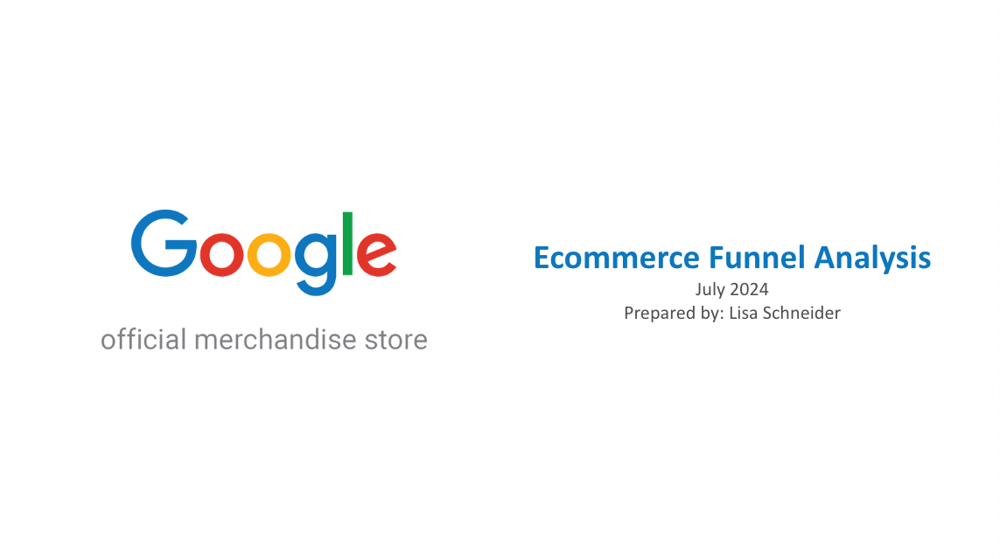

# Project: Funnel Analysis Google Merchandise Store

--------------------------------------------
## Project Objective

The objective for this project ws to do a funnel analysis based on Google Analytics data for the Google Merchandise Store. A dataset with Google Analystics event data was used for as a basis for the analysis.  

**Questions this project aimed to answer:**
1. How does the conversion funnel look like on total level for the top 3 countries and per country?
2. Can we see any differences in the funnel between top 3 countries?
3. Where in the funnel do we see the biggest drop-offs and potential issues?
4. How do the funnel metrics compare against industry standards?
5. Do we see differences in the funnel for top 3 countries based on device type?

**Tools used**
SQL in BigQuery, Google Sheets, Google Slides

## Project Content

**Exploratory-analysis-funnel-analysis.sql** - SQL file containing the exploratory analysis and data cleaning/ preparation steps taken in BigQuery to retrieve the required data from the dataset

[**Project Workbook**](https://docs.google.com/spreadsheets/d/1BRjZykFknG547Fi_4JO42O8m7Uf4w-DiA15PCFELYPw/edit?usp=sharing) - Google Sheets workbook containing investigation, funnel analysis, visualisations

[**Insights Presentation**](https://docs.google.com/presentation/d/1pw_56iKrZ0t4ZNnOZWZqxuV6YN1skRTtS7xDbHX3bNs/edit?usp=sharing) - Final presentation deck with insights from the funnel analysis

## Data & Context

**Data Source:** [Turing College raw_events table](https://console.cloud.google.com/bigquery?ws=!1m5!1m4!4m3!1stc-da-1!2sturing_data_analytics!3sraw_events)

**Data Timeframe:** 
Start: 2020-11-01 
End: 2021-01-31

## Output

Insights Presentation

